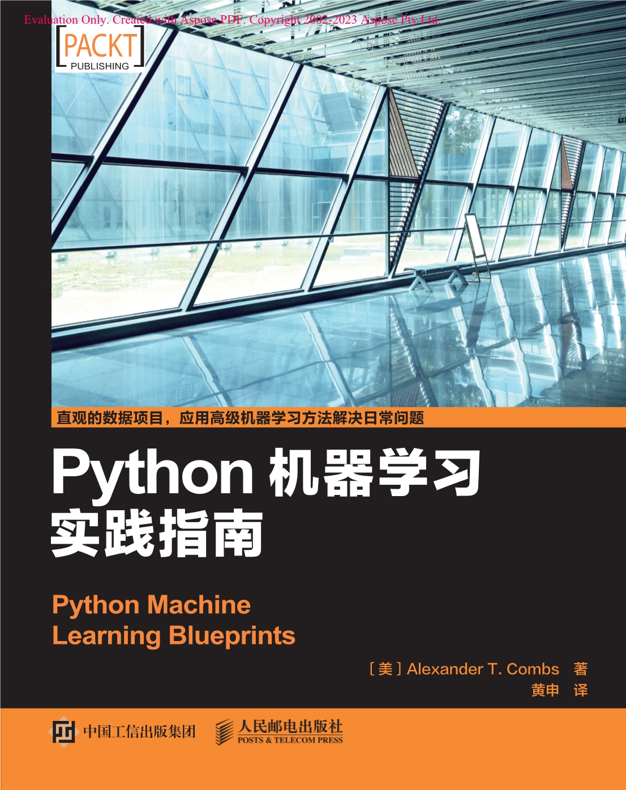
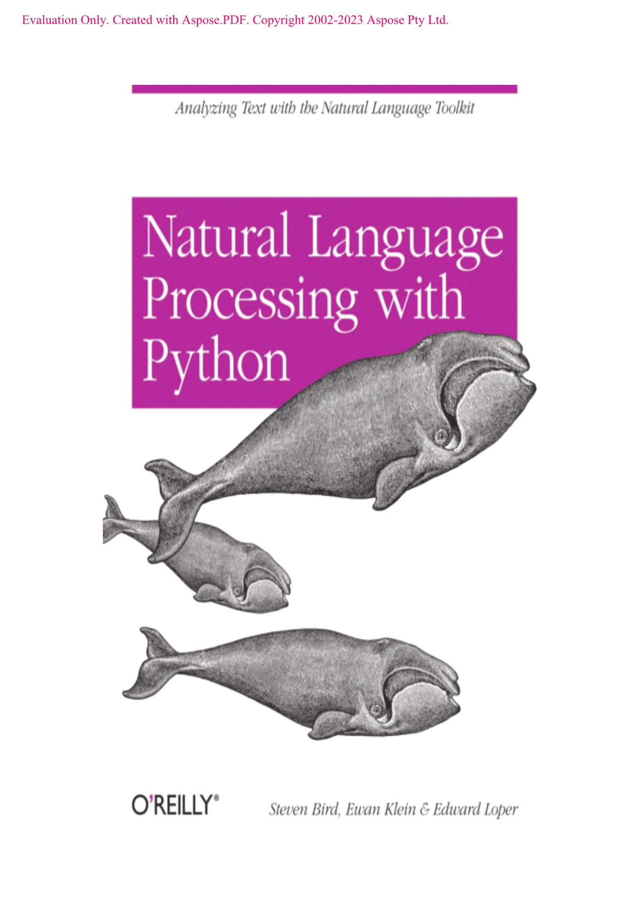
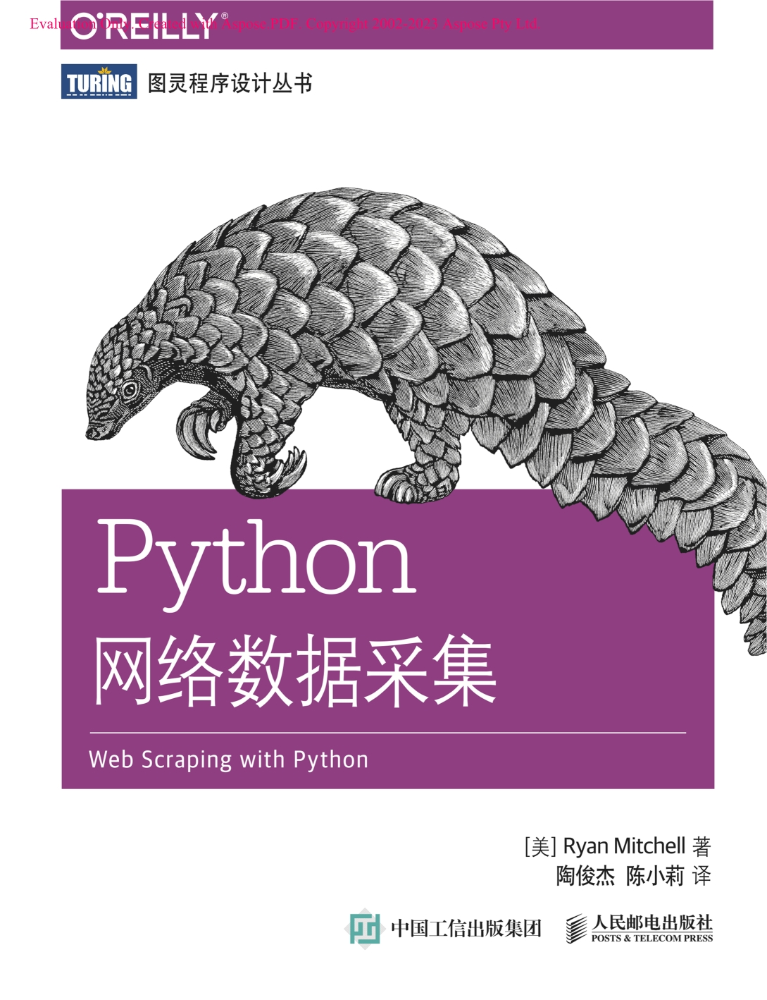
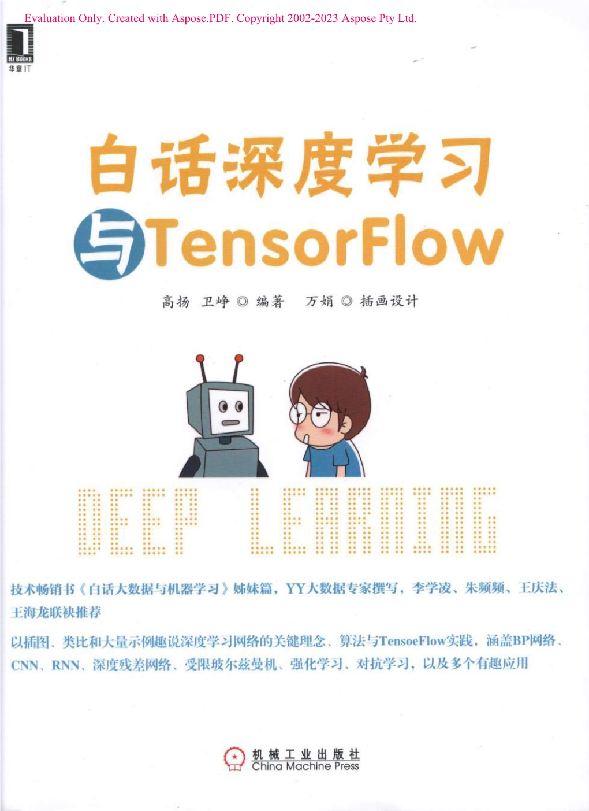
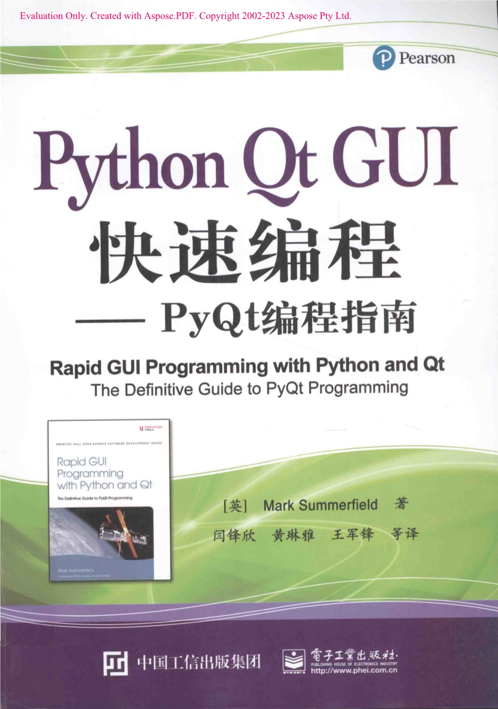

* Python电子书集合,从网上收集整理而成，方便入手Python同学一站式获取。整理不易、需要的，请多多打赏。如果涉及侵权，可联系作者删除。*

|封面图片| 文件名称  |下载地址 | 百度下载描述 |

|  | OpenCV Python中文教程_段立辉译 |[下载链接](http://175.178.46.129:6001/downloadfile/OpenCV+Python中文教程_段立辉译.zip) | [百度下载链接]-链接: https://pan.baidu.com/s/1Tbp4me5YK7W4GX4_rVnzlA 提取码: 8888 复制这段内容后打开百度网盘手机App，操作更方便哦 |

|  | Python 2.6 Text Processing_Jeff McNeil |[下载链接](http://175.178.46.129:6001/downloadfile/Python+2.6+Text+Processing_Jeff+McNeil.zip) | [百度下载链接]-链接: https://pan.baidu.com/s/1Pd2ASs6SC4Yc3IkqXEgi8A 提取码: 8888 复制这段内容后打开百度网盘手机App，操作更方便哦 |

|  | Python Cookbook中文第三版_David Beazley |[下载链接](http://175.178.46.129:6001/downloadfile/Python+Cookbook中文第三版_David+Beazley.zip) | [百度下载链接]-链接: https://pan.baidu.com/s/1Pd2ASs6SC4Yc3IkqXEgi8A 提取码: 8888 复制这段内容后打开百度网盘手机App，操作更方便哦 |

|  | Python Web开发测试驱动方法_Harry_JW_Percival |[下载链接](http://175.178.46.129:6001/downloadfile/Python+Web开发测试驱动方法_Harry_JW_Percival.zip) | [百度下载链接]-链接: https://pan.baidu.com/s/1Pd2ASs6SC4Yc3IkqXEgi8A 提取码: 8888 复制这段内容后打开百度网盘手机App，操作更方便哦 |

|  | Python3程序开发指南_第二版_Mark Summerfield |[下载链接](http://175.178.46.129:6001/downloadfile/Python3程序开发指南_第二版_Mark+Summerfield.zip) | [百度下载链接]-链接: https://pan.baidu.com/s/1Pd2ASs6SC4Yc3IkqXEgi8A 提取码: 8888 复制这段内容后打开百度网盘手机App，操作更方便哦 |

|  | Python编程从入门到实战_Eric Matthes |[下载链接](http://175.178.46.129:6001/downloadfile/Python编程从入门到实战_Eric+Matthes.zip) | [百度下载链接]-链接: https://pan.baidu.com/s/1Pd2ASs6SC4Yc3IkqXEgi8A 提取码: 8888 复制这段内容后打开百度网盘手机App，操作更方便哦 |

|  | Python编程导论_第2版_JohnV Guttag |[下载链接](http://175.178.46.129:6001/downloadfile/Python编程导论_第2版_JohnV+Guttag.zip) | [百度下载链接]-链接: https://pan.baidu.com/s/1Pd2ASs6SC4Yc3IkqXEgi8A 提取码: 8888 复制这段内容后打开百度网盘手机App，操作更方便哦 |

|  | Python编程快速上手—让繁琐工作自动化_AI Sweigart |[下载链接](http://175.178.46.129:6001/downloadfile/Python编程快速上手—让繁琐工作自动化_AI+Sweigart.zip) | [百度下载链接]-链接: https://pan.baidu.com/s/1Pd2ASs6SC4Yc3IkqXEgi8A 提取码: 8888 复制这段内容后打开百度网盘手机App，操作更方便哦 |

|  | Python参考手册_第4版_DavidM Beazley |[下载链接](http://175.178.46.129:6001/downloadfile/Python参考手册_第4版_DavidM+Beazley.zip) | [百度下载链接]-链接: https://pan.baidu.com/s/1Pd2ASs6SC4Yc3IkqXEgi8A 提取码: 8888 复制这段内容后打开百度网盘手机App，操作更方便哦 |

|  | Python程序员指南_汪兴东 |[下载链接](http://175.178.46.129:6001/downloadfile/Python程序员指南_汪兴东.zip) | [百度下载链接]-链接: https://pan.baidu.com/s/1Pd2ASs6SC4Yc3IkqXEgi8A 提取码: 8888 复制这段内容后打开百度网盘手机App，操作更方便哦 |

|  | Python地理空间分析指南_第2版_Joel Lawhead |[下载链接](http://175.178.46.129:6001/downloadfile/Python地理空间分析指南_第2版_Joel+Lawhead.zip) | [百度下载链接]-链接: https://pan.baidu.com/s/1Pd2ASs6SC4Yc3IkqXEgi8A 提取码: 8888 复制这段内容后打开百度网盘手机App，操作更方便哦 |

|  | Python高级编程_Luke Sneeringer |[下载链接](http://175.178.46.129:6001/downloadfile/Python高级编程_Luke+Sneeringer.zip) | [百度下载链接]-链接: https://pan.baidu.com/s/1Pd2ASs6SC4Yc3IkqXEgi8A 提取码: 8888 复制这段内容后打开百度网盘手机App，操作更方便哦 |

|  | Python高性能编程_Micha Gorelick |[下载链接](http://175.178.46.129:6001/downloadfile/Python高性能编程_Micha+Gorelick.zip) | [百度下载链接]-链接: https://pan.baidu.com/s/1Pd2ASs6SC4Yc3IkqXEgi8A 提取码: 8888 复制这段内容后打开百度网盘手机App，操作更方便哦 |

|  | Python核心编程_第3版_Wesley Chun |[下载链接](http://175.178.46.129:6001/downloadfile/Python核心编程_第3版_Wesley+Chun.zip) | [百度下载链接]-链接: https://pan.baidu.com/s/1Pd2ASs6SC4Yc3IkqXEgi8A 提取码: 8888 复制这段内容后打开百度网盘手机App，操作更方便哦 |

|  | Python核心编程_第二版_WesleyJ Chun |[下载链接](http://175.178.46.129:6001/downloadfile/Python核心编程_第二版_WesleyJ+Chun.zip) | [百度下载链接]-链接: https://pan.baidu.com/s/1Pd2ASs6SC4Yc3IkqXEgi8A 提取码: 8888 复制这段内容后打开百度网盘手机App，操作更方便哦 |

|  | Python灰帽子-黑客与逆向工程师的Python编程之道_Justin Scitz |[下载链接](http://175.178.46.129:6001/downloadfile/Python灰帽子-黑客与逆向工程师的Python编程之道_Justin+Scitz.zip) | [百度下载链接]-链接: https://pan.baidu.com/s/1Pd2ASs6SC4Yc3IkqXEgi8A 提取码: 8888 复制这段内容后打开百度网盘手机App，操作更方便哦 |

|  | Python机器学习及实践-从零开始通往Kaggle竞赛之路_范淼 |[下载链接](http://175.178.46.129:6001/downloadfile/Python机器学习及实践-从零开始通往Kaggle竞赛之路_范淼.zip) | [百度下载链接]-链接: https://pan.baidu.com/s/1Pd2ASs6SC4Yc3IkqXEgi8A 提取码: 8888 复制这段内容后打开百度网盘手机App，操作更方便哦 |

|  | Python机器学习实践指南_AlexanderT Combs |[下载链接](http://175.178.46.129:6001/downloadfile/Python机器学习实践指南_AlexanderT+Combs.zip) | [百度下载链接]-链接: https://pan.baidu.com/s/1Pd2ASs6SC4Yc3IkqXEgi8A 提取码: 8888 复制这段内容后打开百度网盘手机App，操作更方便哦 |

|  | Python基础教程_第3版_Magnus Lie Hetland |[下载链接](http://175.178.46.129:6001/downloadfile/Python基础教程_第3版_Magnus+Lie+Hetland.zip) | [百度下载链接]-链接: https://pan.baidu.com/s/1Pd2ASs6SC4Yc3IkqXEgi8A 提取码: 8888 复制这段内容后打开百度网盘手机App，操作更方便哦 |

|  | Python技术参考大全_MartinC Brown |[下载链接](http://175.178.46.129:6001/downloadfile/Python技术参考大全_MartinC+Brown.zip) | [百度下载链接]-链接: https://pan.baidu.com/s/1Pd2ASs6SC4Yc3IkqXEgi8A 提取码: 8888 复制这段内容后打开百度网盘手机App，操作更方便哦 |

|  | Python进行自然语言处理_Steven Bird |[下载链接](http://175.178.46.129:6001/downloadfile/Python进行自然语言处理_Steven+Bird.zip) | [百度下载链接]-链接: https://pan.baidu.com/s/1Pd2ASs6SC4Yc3IkqXEgi8A 提取码: 8888 复制这段内容后打开百度网盘手机App，操作更方便哦 |

|  | Python科学计算_张若愚 |[下载链接](http://175.178.46.129:6001/downloadfile/Python科学计算_张若愚.zip) | [百度下载链接]-链接: https://pan.baidu.com/s/1Pd2ASs6SC4Yc3IkqXEgi8A 提取码: 8888 复制这段内容后打开百度网盘手机App，操作更方便哦 |

|  | Python数据处理_Jacqueline Kazil |[下载链接](http://175.178.46.129:6001/downloadfile/Python数据处理_Jacqueline+Kazil.zip) | [百度下载链接]-链接: https://pan.baidu.com/s/1Pd2ASs6SC4Yc3IkqXEgi8A 提取码: 8888 复制这段内容后打开百度网盘手机App，操作更方便哦 |

|  | Python数据分析基础_ClintonW Brownley |[下载链接](http://175.178.46.129:6001/downloadfile/Python数据分析基础_ClintonW+Brownley.zip) | [百度下载链接]-链接: https://pan.baidu.com/s/1Pd2ASs6SC4Yc3IkqXEgi8A 提取码: 8888 复制这段内容后打开百度网盘手机App，操作更方便哦 |

|  | Python数据分析基础教程NumPy学习指南_第2版_Ivan Idris |[下载链接](http://175.178.46.129:6001/downloadfile/Python数据分析基础教程NumPy学习指南_第2版_Ivan+Idris.zip) | [百度下载链接]-链接: https://pan.baidu.com/s/1Pd2ASs6SC4Yc3IkqXEgi8A 提取码: 8888 复制这段内容后打开百度网盘手机App，操作更方便哦 |

|  | Python数据分析实战_Fabio Nelli |[下载链接](http://175.178.46.129:6001/downloadfile/Python数据分析实战_Fabio+Nelli.zip) | [百度下载链接]-链接: https://pan.baidu.com/s/1Pd2ASs6SC4Yc3IkqXEgi8A 提取码: 8888 复制这段内容后打开百度网盘手机App，操作更方便哦 |

|  | Python数据科学手册_Jake VanderPlas |[下载链接](http://175.178.46.129:6001/downloadfile/Python数据科学手册_Jake+VanderPlas.zip) | [百度下载链接]-链接: https://pan.baidu.com/s/1Pd2ASs6SC4Yc3IkqXEgi8A 提取码: 8888 复制这段内容后打开百度网盘手机App，操作更方便哦 |

|  | Python数据可视化编程实战_Igor Milovanovic |[下载链接](http://175.178.46.129:6001/downloadfile/Python数据可视化编程实战_Igor+Milovanovic.zip) | [百度下载链接]-链接: https://pan.baidu.com/s/1Pd2ASs6SC4Yc3IkqXEgi8A 提取码: 8888 复制这段内容后打开百度网盘手机App，操作更方便哦 |

|  | Python网络编程基础_John Goerzen |[下载链接](http://175.178.46.129:6001/downloadfile/Python网络编程基础_John+Goerzen.zip) | [百度下载链接]-链接: https://pan.baidu.com/s/1Pd2ASs6SC4Yc3IkqXEgi8A 提取码: 8888 复制这段内容后打开百度网盘手机App，操作更方便哦 |

|  | Python网络数据采集_Ryan Mitchell |[下载链接](http://175.178.46.129:6001/downloadfile/Python网络数据采集_Ryan+Mitchell.zip) | [百度下载链接]-链接: https://pan.baidu.com/s/1Pd2ASs6SC4Yc3IkqXEgi8A 提取码: 8888 复制这段内容后打开百度网盘手机App，操作更方便哦 |

|  | Python学习手册_第3版_Mark Lutz |[下载链接](http://175.178.46.129:6001/downloadfile/Python学习手册_第3版_Mark+Lutz.zip) | [百度下载链接]-链接: https://pan.baidu.com/s/1Pd2ASs6SC4Yc3IkqXEgi8A 提取码: 8888 复制这段内容后打开百度网盘手机App，操作更方便哦 |

|  | Python语言及其应用_Bill Lubanovic |[下载链接](http://175.178.46.129:6001/downloadfile/Python语言及其应用_Bill+Lubanovic.zip) | [百度下载链接]-链接: https://pan.baidu.com/s/1Pd2ASs6SC4Yc3IkqXEgi8A 提取码: 8888 复制这段内容后打开百度网盘手机App，操作更方便哦 |

|  | Python语言入门_Mark Lutz |[下载链接](http://175.178.46.129:6001/downloadfile/Python语言入门_Mark+Lutz.zip) | [百度下载链接]-链接: https://pan.baidu.com/s/1Pd2ASs6SC4Yc3IkqXEgi8A 提取码: 8888 复制这段内容后打开百度网盘手机App，操作更方便哦 |

|  | Python源码剖析-深度探索动态语言核心技术_陈儒 |[下载链接](http://175.178.46.129:6001/downloadfile/Python源码剖析-深度探索动态语言核心技术_陈儒.zip) | [百度下载链接]-链接: https://pan.baidu.com/s/1Pd2ASs6SC4Yc3IkqXEgi8A 提取码: 8888 复制这段内容后打开百度网盘手机App，操作更方便哦 |

|  | Selenium2自动化测试实战_基于Python语言_虫师 |[下载链接](http://175.178.46.129:6001/downloadfile/Selenium2自动化测试实战_基于Python语言_虫师.zip) | [百度下载链接]-链接: https://pan.baidu.com/s/1Pd2ASs6SC4Yc3IkqXEgi8A 提取码: 8888 复制这段内容后打开百度网盘手机App，操作更方便哦 |

|  | wxPython In Action_Noel Rappin |[下载链接](http://175.178.46.129:6001/downloadfile/wxPython+In+Action_Noel+Rappin.zip) | [百度下载链接]-链接: https://pan.baidu.com/s/1Pd2ASs6SC4Yc3IkqXEgi8A 提取码: 8888 复制这段内容后打开百度网盘手机App，操作更方便哦 |

|  | 白话深度学习与TensorFlow_高杨 |[下载链接](http://175.178.46.129:6001/downloadfile/白话深度学习与TensorFlow_高杨.zip) | [百度下载链接]-链接: https://pan.baidu.com/s/1Pd2ASs6SC4Yc3IkqXEgi8A 提取码: 8888 复制这段内容后打开百度网盘手机App，操作更方便哦 |

|  | 贝叶斯思维_统计建模的Python学习法_AllenB Downey |[下载链接](http://175.178.46.129:6001/downloadfile/贝叶斯思维_统计建模的Python学习法_AllenB+Downey.zip) | [百度下载链接]-链接: https://pan.baidu.com/s/1Pd2ASs6SC4Yc3IkqXEgi8A 提取码: 8888 复制这段内容后打开百度网盘手机App，操作更方便哦 |

|  | 编程小白的第1本Python入门书_侯爵 |[下载链接](http://175.178.46.129:6001/downloadfile/编程小白的第1本Python入门书_侯爵.zip) | [百度下载链接]-链接: https://pan.baidu.com/s/1Pd2ASs6SC4Yc3IkqXEgi8A 提取码: 8888 复制这段内容后打开百度网盘手机App，操作更方便哦 |

|  | 从Excel到Python数据分析进阶指南_王彦平 |[下载链接](http://175.178.46.129:6001/downloadfile/从Excel到Python数据分析进阶指南_王彦平.zip) | [百度下载链接]-链接: https://pan.baidu.com/s/1Pd2ASs6SC4Yc3IkqXEgi8A 提取码: 8888 复制这段内容后打开百度网盘手机App，操作更方便哦 |

|  | 从Python开始学编程_Vamei |[下载链接](http://175.178.46.129:6001/downloadfile/从Python开始学编程_Vamei.zip) | [百度下载链接]-链接: https://pan.baidu.com/s/1Pd2ASs6SC4Yc3IkqXEgi8A 提取码: 8888 复制这段内容后打开百度网盘手机App，操作更方便哦 |

|  | 机器学习实战_Peter Harrington |[下载链接](http://175.178.46.129:6001/downloadfile/机器学习实战_Peter+Harrington.zip) | [百度下载链接]-链接: https://pan.baidu.com/s/1Pd2ASs6SC4Yc3IkqXEgi8A 提取码: 8888 复制这段内容后打开百度网盘手机App，操作更方便哦 |

|  | 简明Python教程_沈洁元 |[下载链接](http://175.178.46.129:6001/downloadfile/简明Python教程_沈洁元.zip) | [百度下载链接]-链接: https://pan.baidu.com/s/1Pd2ASs6SC4Yc3IkqXEgi8A 提取码: 8888 复制这段内容后打开百度网盘手机App，操作更方便哦 |

|  | 精通Python设计模式_Sakis Kasampalis |[下载链接](http://175.178.46.129:6001/downloadfile/精通Python设计模式_Sakis+Kasampalis.zip) | [百度下载链接]-链接: https://pan.baidu.com/s/1Pd2ASs6SC4Yc3IkqXEgi8A 提取码: 8888 复制这段内容后打开百度网盘手机App，操作更方便哦 |

|  | 流畅的Python_Luciano Ramalho |[下载链接](http://175.178.46.129:6001/downloadfile/流畅的Python_Luciano+Ramalho.zip) | [百度下载链接]-链接: https://pan.baidu.com/s/1Pd2ASs6SC4Yc3IkqXEgi8A 提取码: 8888 复制这段内容后打开百度网盘手机App，操作更方便哦 |

|  | 面向机器智能TensorFlow实践_Sam Abrahams |[下载链接](http://175.178.46.129:6001/downloadfile/面向机器智能TensorFlow实践_Sam+Abrahams.zip) | [百度下载链接]-链接: https://pan.baidu.com/s/1Pd2ASs6SC4Yc3IkqXEgi8A 提取码: 8888 复制这段内容后打开百度网盘手机App，操作更方便哦 |

|  | 轻量级Diango_Julia Elman |[下载链接](http://175.178.46.129:6001/downloadfile/轻量级Diango_Julia+Elman.zip) | [百度下载链接]-链接: https://pan.baidu.com/s/1Pd2ASs6SC4Yc3IkqXEgi8A 提取码: 8888 复制这段内容后打开百度网盘手机App，操作更方便哦 |

|  | 社交网站的数据挖掘与分析_Mattbew A Russell |[下载链接](http://175.178.46.129:6001/downloadfile/社交网站的数据挖掘与分析_Mattbew+A+Russell.zip) | [百度下载链接]-链接: https://pan.baidu.com/s/1Pd2ASs6SC4Yc3IkqXEgi8A 提取码: 8888 复制这段内容后打开百度网盘手机App，操作更方便哦 |

|  | 深度学习中文版_Ian Goodfellow |[下载链接](http://175.178.46.129:6001/downloadfile/深度学习中文版_Ian+Goodfellow.zip) | [百度下载链接]-链接: https://pan.baidu.com/s/1Pd2ASs6SC4Yc3IkqXEgi8A 提取码: 8888 复制这段内容后打开百度网盘手机App，操作更方便哦 |

|  | 数据科学入门_Joel Grus |[下载链接](http://175.178.46.129:6001/downloadfile/数据科学入门_Joel+Grus.zip) | [百度下载链接]-链接: https://pan.baidu.com/s/1Pd2ASs6SC4Yc3IkqXEgi8A 提取码: 8888 复制这段内容后打开百度网盘手机App，操作更方便哦 |

|  | 用Python写网络爬虫_Richard Lawson |[下载链接](http://175.178.46.129:6001/downloadfile/用Python写网络爬虫_Richard+Lawson.zip) | [百度下载链接]-链接: https://pan.baidu.com/s/1Pd2ASs6SC4Yc3IkqXEgi8A 提取码: 8888 复制这段内容后打开百度网盘手机App，操作更方便哦 |

|  | 与孩子一起学编程_Warren Sande |[下载链接](http://175.178.46.129:6001/downloadfile/与孩子一起学编程_Warren+Sande.zip) | [百度下载链接]-链接: https://pan.baidu.com/s/1Pd2ASs6SC4Yc3IkqXEgi8A 提取码: 8888 复制这段内容后打开百度网盘手机App，操作更方便哦 |

|  | Python Web开发实战_董伟明 |[下载链接](http://175.178.46.129:6001/downloadfile/Python+Web开发实战_董伟明.zip) | [百度下载链接]-链接: https://pan.baidu.com/s/1Pd2ASs6SC4Yc3IkqXEgi8A 提取码: 8888 复制这段内容后打开百度网盘手机App，操作更方便哦 |

|  | Python_Qt_GUI快速编程--PyQt编程指南_Mark_Summerfield |[下载链接](http://175.178.46.129:6001/downloadfile/Python_Qt_GUI快速编程--PyQt编程指南_Mark_Summerfield.zip) | [百度下载链接]-链接: https://pan.baidu.com/s/1Pd2ASs6SC4Yc3IkqXEgi8A 提取码: 8888 复制这段内容后打开百度网盘手机App，操作更方便哦 |

|  | Python编程初学者指南_Michael Dawson |[下载链接](http://175.178.46.129:6001/downloadfile/Python编程初学者指南_Michael+Dawson.zip) | [百度下载链接]-链接: https://pan.baidu.com/s/1Pd2ASs6SC4Yc3IkqXEgi8A 提取码: 8888 复制这段内容后打开百度网盘手机App，操作更方便哦 |

|  | Python编程入门经典_James Payne |[下载链接](http://175.178.46.129:6001/downloadfile/Python编程入门经典_James+Payne.zip) | [百度下载链接]-链接: https://pan.baidu.com/s/1Pd2ASs6SC4Yc3IkqXEgi8A 提取码: 8888 复制这段内容后打开百度网盘手机App，操作更方便哦 |

|  | Python编程实战 运用设计模式_并发和程序库创建高质量程序_Mark Summerfield |[下载链接](http://175.178.46.129:6001/downloadfile/Python编程实战+运用设计模式_并发和程序库创建高质量程序_Mark+Summerfield.zip) | [百度下载链接]-链接: https://pan.baidu.com/s/1Pd2ASs6SC4Yc3IkqXEgi8A 提取码: 8888 复制这段内容后打开百度网盘手机App，操作更方便哦 |

|  | Python高级编程_第2版_Michal Jaworski |[下载链接](http://175.178.46.129:6001/downloadfile/Python高级编程_第2版_Michal+Jaworski.zip) | [百度下载链接]-链接: https://pan.baidu.com/s/1Pd2ASs6SC4Yc3IkqXEgi8A 提取码: 8888 复制这段内容后打开百度网盘手机App，操作更方便哦 |

|  | Python金融大数据分析_Yves Hilpisch |[下载链接](http://175.178.46.129:6001/downloadfile/Python金融大数据分析_Yves+Hilpisch.zip) | [百度下载链接]-链接: https://pan.baidu.com/s/1Pd2ASs6SC4Yc3IkqXEgi8A 提取码: 8888 复制这段内容后打开百度网盘手机App，操作更方便哦 |

|  | Python开发技术详解_周伟 |[下载链接](http://175.178.46.129:6001/downloadfile/Python开发技术详解_周伟.zip) | [百度下载链接]-链接: https://pan.baidu.com/s/1Pd2ASs6SC4Yc3IkqXEgi8A 提取码: 8888 复制这段内容后打开百度网盘手机App，操作更方便哦 |

|  | Python开发实战_盛荣译 |[下载链接](http://175.178.46.129:6001/downloadfile/Python开发实战_盛荣译.zip) | [百度下载链接]-链接: https://pan.baidu.com/s/1Pd2ASs6SC4Yc3IkqXEgi8A 提取码: 8888 复制这段内容后打开百度网盘手机App，操作更方便哦 |

|  | Python面向对象编程指南_Steven F Lott |[下载链接](http://175.178.46.129:6001/downloadfile/Python面向对象编程指南_Steven+F+Lott.zip) | [百度下载链接]-链接: https://pan.baidu.com/s/1Pd2ASs6SC4Yc3IkqXEgi8A 提取码: 8888 复制这段内容后打开百度网盘手机App，操作更方便哦 |

|  | Python爬虫开发与项目实战_范传辉 |[下载链接](http://175.178.46.129:6001/downloadfile/Python爬虫开发与项目实战_范传辉.zip) | [百度下载链接]-链接: https://pan.baidu.com/s/1Pd2ASs6SC4Yc3IkqXEgi8A 提取码: 8888 复制这段内容后打开百度网盘手机App，操作更方便哦 |

|  | Python入门经典_以解决计算问题为导向的Python编程_WilliamF Punch |[下载链接](http://175.178.46.129:6001/downloadfile/Python入门经典_以解决计算问题为导向的Python编程_WilliamF+Punch.zip) | [百度下载链接]-链接: https://pan.baidu.com/s/1Pd2ASs6SC4Yc3IkqXEgi8A 提取码: 8888 复制这段内容后打开百度网盘手机App，操作更方便哦 |

|  | Python学习手册_第4版_Mark Lutz |[下载链接](http://175.178.46.129:6001/downloadfile/Python学习手册_第4版_Mark+Lutz.zip) | [百度下载链接]-链接: https://pan.baidu.com/s/1Pd2ASs6SC4Yc3IkqXEgi8A 提取码: 8888 复制这段内容后打开百度网盘手机App，操作更方便哦 |

|  | TensorFlow实战Google深度学习框架_郑泽宇 |[下载链接](http://175.178.46.129:6001/downloadfile/TensorFlow实战Google深度学习框架_郑泽宇.zip) | [百度下载链接]-链接: https://pan.baidu.com/s/1Pd2ASs6SC4Yc3IkqXEgi8A 提取码: 8888 复制这段内容后打开百度网盘手机App，操作更方便哦 |

|  | 编写高质量代码改善Python程序的91个建议_张颖 |[下载链接](http://175.178.46.129:6001/downloadfile/编写高质量代码改善Python程序的91个建议_张颖.zip) | [百度下载链接]-链接: https://pan.baidu.com/s/1Pd2ASs6SC4Yc3IkqXEgi8A 提取码: 8888 复制这段内容后打开百度网盘手机App，操作更方便哦 |

|  | 利用Python进行数据分析_Wes McKinney |[下载链接](http://175.178.46.129:6001/downloadfile/利用Python进行数据分析_Wes+McKinney.zip) | [百度下载链接]-链接: https://pan.baidu.com/s/1Pd2ASs6SC4Yc3IkqXEgi8A 提取码: 8888 复制这段内容后打开百度网盘手机App，操作更方便哦 |

|  | 量化投资以Python为工具_蔡立耑 |[下载链接](http://175.178.46.129:6001/downloadfile/量化投资以Python为工具_蔡立耑.zip) | [百度下载链接]-链接: https://pan.baidu.com/s/1Pd2ASs6SC4Yc3IkqXEgi8A 提取码: 8888 复制这段内容后打开百度网盘手机App，操作更方便哦 |

|  | 数据结构与算法Python语言描述_裘宗燕 |[下载链接](http://175.178.46.129:6001/downloadfile/数据结构与算法Python语言描述_裘宗燕.zip) | [百度下载链接]-链接: https://pan.baidu.com/s/1Pd2ASs6SC4Yc3IkqXEgi8A 提取码: 8888 复制这段内容后打开百度网盘手机App，操作更方便哦 |

|  | 征服Python-语言基础与典型应用_孙广磊 |[下载链接](http://175.178.46.129:6001/downloadfile/征服Python-语言基础与典型应用_孙广磊.zip) | [百度下载链接]-链接: https://pan.baidu.com/s/1Pd2ASs6SC4Yc3IkqXEgi8A 提取码: 8888 复制这段内容后打开百度网盘手机App，操作更方便哦 |

